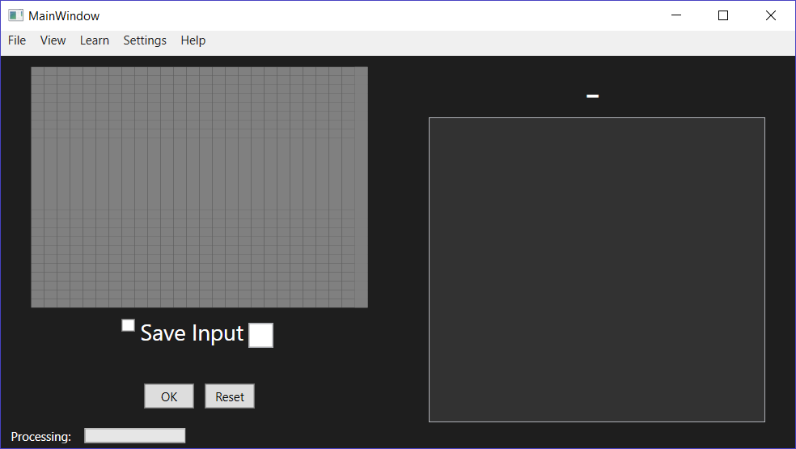
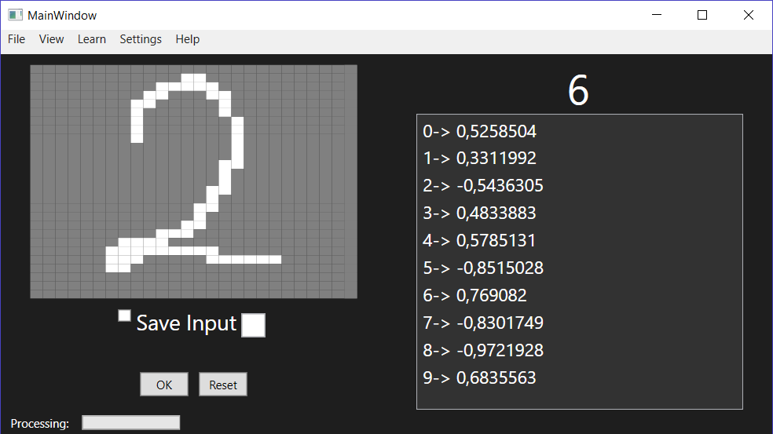
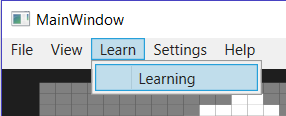
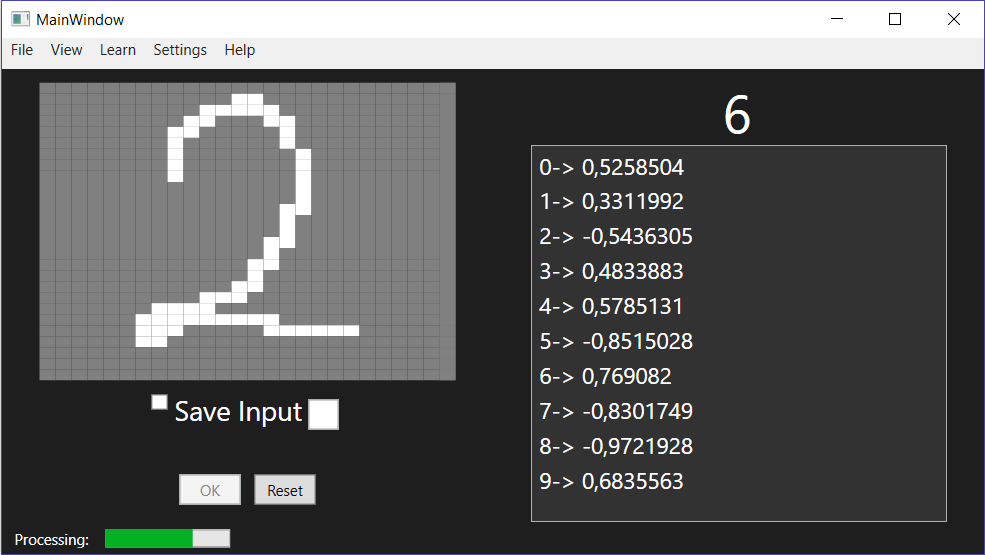
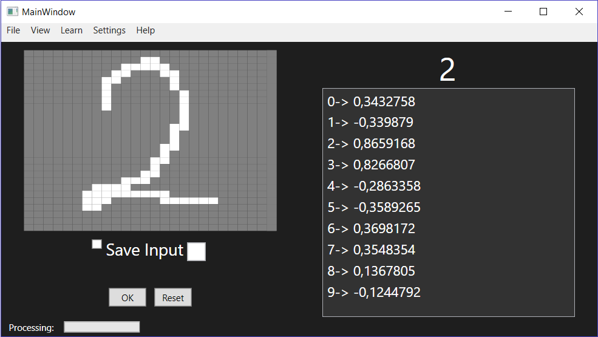
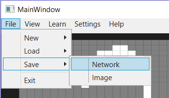
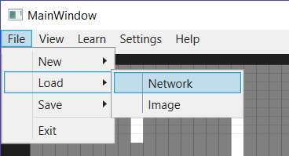
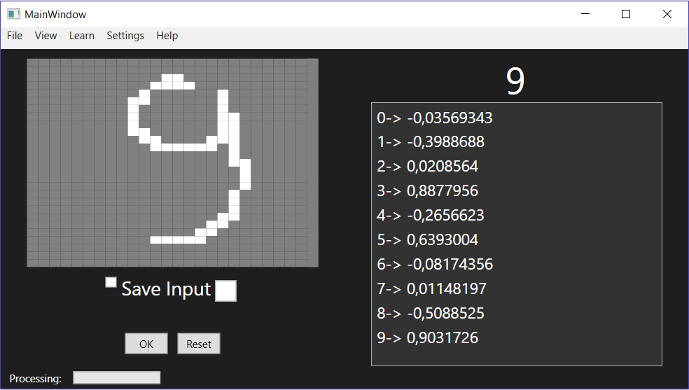
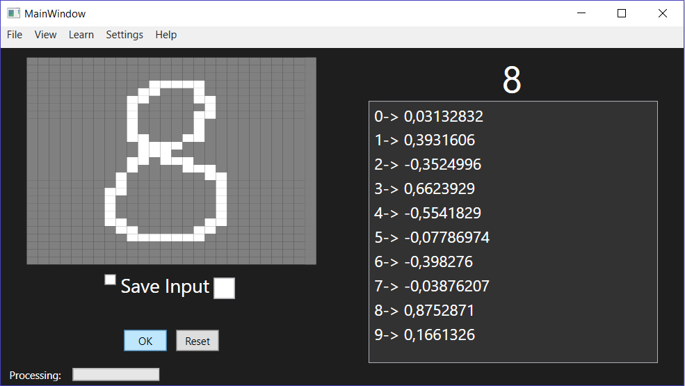

# NumberRecognition with neural network
Az alábbi projekt a neurális hálózatok felhasználásának egy lehetőségét mutatja be, amik segítségével kézzel írt számjegyeket is lehetőségünk van felismerni.

Fontos, hogy a projekt célja nem egy rugalmasan felhasználható és módosítható program létrehozása, hanem egy "bedrótozott" hálózat felhasználása számjegyfelismerésre. A hálózatot lehessen tanítani, felhasználni, menteni illetve beolvasni külső fileból. Ezen kívül további funkciók implementálása nem cél.

A projekt megvalósításának éve: 2018

**Tervezet**

A felületnek lehetőséget kell biztosítania az alábbiaknak:

-Kép importálásának lehetősége. (fix, 27*27 pixelből álló képek)

-Számjegy rajzolása valós időben.

-Számjegy felismerése és ez alapján egy rangsor előállítása, melyik számjegyre hasonlít még a rajzolt / tallózott kép.

Ezen kritériumok alapján az alábbi felépítés megvalósítása elegendő:

**Az elkészült szoftver bemutatása**

A program megnyitásakor az alap kezdő felület jelenik meg.

Ez a felület tartalmazza a következőket:

-Rajztábla

-Rajzolt szám mentésének lehetősége a későbbi tanulási példák felhasználásának céljából

-A rajzolt szám felismerésének megpróbálása

-A rajztábla törlése

-A kiértékelés eredményének megjelenítésére szolgáló elem

-Jelző elem, mely jelzi, hogy az aktuális művelet hol tart a végrehajtásban (pl tanulás)

Egy alap, még nem tanított háló felhasználásával a kép felismerése:

Van lehetőségünk tanítani az alapértelmezetten beágyazott neurális hálózatunkat, növelve annak felismerési teljesítményét:

A tanítási folyamatot egy ProgressBar segítségével követketjük nyomon:

A tanítás után nőtt a teljesítmény:

Lehetőségünk van még menteni a már betanított neurális hálózatot későbbi felhasználás céljából:

Vagy beolvasni neurális hálózatot korábban lementett fileból. 

Néhány további kép a felismerés sikerességéről:

**Továbbfejlesztési lehetőségek**

-Neurális hálózat felépítésének módosítása.

-Cserélhető forrás illetve cél fájlok
