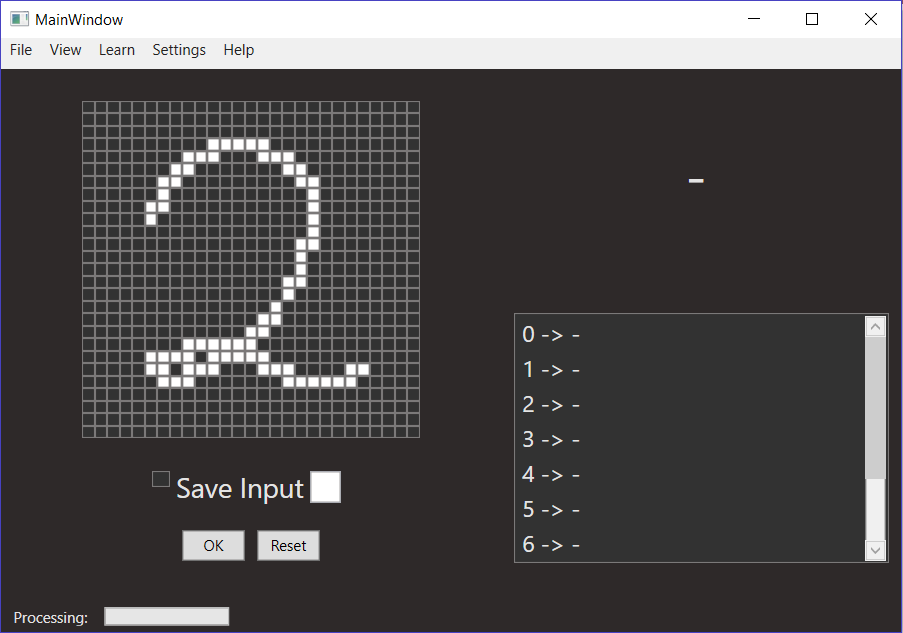

# NumberRecognition with neural network
Az alábbi projekt a neurális hálózatok felhasználásának egy lehetőségét mutatja be, amik segítségével kézzel írt számjegyeket is lehetőségünk van felismerni.

**Tervezet**

A felületnek lehetőséget kell biztosítania az alábbiaknak:

-Kép importálásának lehetősége. (fix, 27*27 pixelből álló képek)

-Számjegy rajzolása valós időben.

-Számjegy felismerése és ez alapján egy rangsor előállítása, melyik számjegyre hasonlít még a rajzolt / tallózott kép.

Ezen kritériumok alapján az alábbi felépítés megvalósítása elegendő:

**Továbbfejlesztési lehetőségek**

-Neurális hálózat felépítésének módosítása.

-A hálózat valós idejű tanítása.

-A hálótat importálása/exportálása.

-Magasabb számítási igénnyel rendelkező műveletek kezelése szálakkal és jelzés az aktuális állapotról a felhasználónak.

-Rajzolt számjegy mentésének lehetősége és felhasználása a későbbi tanítási folyamatokhoz.
